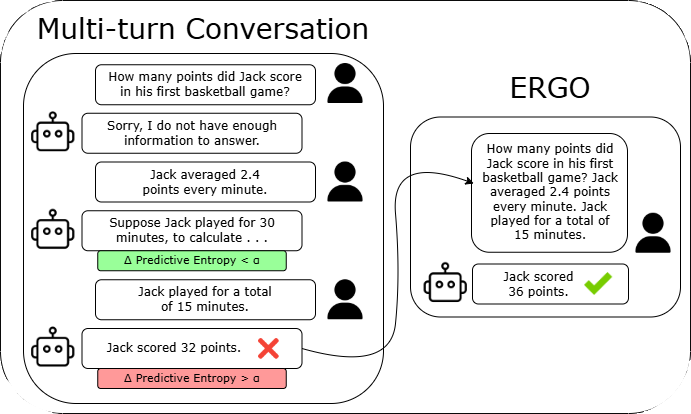

<div align="center">

# ERGO: Entropy-guided Resetting for Generation Optimization



[](https://github.com/haziq-exe/ERGO)
[](https://www.python.org/)

• [Paper (Coming Soon)](https://github.com/haziq-exe/ERGO) • [Quick Start](https://github.com/haziq-exe/ERGO?tab=readme-ov-file#quick-start) • [Repository Structure](https://github.com/haziq-exe/ERGO?tab=readme-ov-file#repository-structure) • [Results](https://github.com/haziq-exe/ERGO?tab=readme-ov-file#key-results) • [Contact](https://github.com/haziq-exe/ERGO?tab=readme-ov-file#contact) • 

</div>

---

## Overview

**ERGO** introduces a paradigm shift in handling multi-turn LLM conversations by treating uncertainty as a first-class signal. When large language models get "lost" in extended conversations, ERGO detects these moments through entropy spikes and strategically resets the context, recovering both accuracy and reliability. This repository contains all code necessary to replicate our experiments and evaluate ERGO’s performance across a suite of models and multi-turn generation tasks.

## Core Results

<div align="center">
<table style="table-layout: fixed; width: 100%;">
<tr>
<td align="center" style="white-space: nowrap; width: 33%;">
<h3>56.6%</h3>
<b>Average Performance Gain</b>
</td>
<td align="center" style="white-space: nowrap; width: 33%;">
<h3>24.7%</h3>
<b>Peak Capability Increase</b>
</td>
<td align="center" style="white-space: nowrap; width: 33%;">
<h3>35.3%</h3>
<b>Decrease in Unreliability</b>
</td>
</tr>
</table>
</div>


## Quick Start

### Prerequisites

```bash
# Clone the repository
git clone https://github.com/haziq-exe/ERGO.git
cd ERGO
pip install -r requirements.txt
```

- To use OpenAI models you will need the environment variable "OPENAI_KEY" to be set to your key.

- You will need to downloaded the following [sharded dataset from Laban et al](https://huggingface.co/datasets/microsoft/lost_in_conversation)

### Basic Usage

```python
from experiments.runExperiment import RunExperiment

# Initialize experiment with your chosen model
experiment = RunExperiment(
    model_name="HuggingFaceTB/SmolLM-135M-Instruct",
    device="cpu",
    device_map=None,
    max_new_tokens=1000
)

# Run ERGO on GSM8K dataset
experiment.run_GSM8K(
    dataset_path="sharded_dataset.json", # path to sharded dataset from Laban et al.
    num_Qs=20,
    num_runs=1,
    threshold=0.5,
    output_path="outputs/gsm8k_example.json"
)
```

Run from root directory:
```bash
python -m main.example_main
```

## Repository Structure

```
ERGO/
│
├── evaluation/         # Evaluation metrics and scoring
│   └── evaluator.py
|   └── utils.py 
│
├── core/               # Core ERGO implementation
│   ├── dataset.py         
│   ├── model.py          
│   └── utils.py          
│
├── experiments/        # Experiment runner
│   └── runExperiment.py  
│
├── generation/         # Generate with ERGO
│   └── generator.py
│
└── main/              # Example scripts
    └── example_main.py
```

## Evaluated Tasks

ERGO has been rigorously tested across five diverse generation tasks:

<div align="center">

| Task | Dataset | Description | Metric |
|:------:|:---------:|:-------------:|:--------:|
| **Math** | GSM8K | Elementary math word problems | Exact Match |
| **Code** | LiveCodeBench | Python function generation | Test Suite Pass |
| **SQL** | Spider | Text-to-SQL query generation | Query Accuracy |
| **API Calls** | Berkeley FCL | Function calling from instructions | Call Validity |
| **Data-to-Text** | ToTTo | Table caption generation | BLEU Score |

</div>

## Key Results

<div align="center">

### Average Performance Across Models

| Model | FULL | SHARDED | ERGO | **Relative Improvement** |
|:-------:|:------:|:---------:|:----------:|:-------------:|
| GPT-4o | 79.2 | 51.4 | 74.1 | **+44.2%** |
| GPT-4.1 | 83.6 | 56.6 | 77.0 | **+36.0%** |
| GPT-4o-mini | 73.8 | 44.3 | 71.8 | **+62.1%** | 
| Phi-4 | 64.6 | 36.4 | 59.2 | **+62.6%** |
| LLaMA-3.1-8B | 46.0 | 28.7 | 50.9 | **+77.4%** |

</div>

## Important Notes

> **Beta Status**: While the codebase is complete and functional, It is still in its early stages. You may encounter bugs, these are being worked on.

> **Documentation**: Comprehensive documentation is in development. For now, please refer to the paper for detailed methodology and theoretical foundations.


## Citation

If you use ERGO in your research, please cite our paper:

```bibtex
@inproceedings{khalid2025ergo,
  title={ERGO: Entropy-guided Resetting for Generation Optimization in Multi-turn Language Models},
  author={Khalid, Haziq Mohammad and Jeyaganthan, Athikash and Do, Timothy and 
          Fu, Yicheng and O'Brien, Sean and Sharma, Vasu and Zhu, Kevin},
  booktitle={Proceedings of the 2nd Workshop on Uncertainty-Aware NLP (UncertaiNLP 2025)}
  year={2025}
}
```

## Contact

**Lead Author**: Haziq Mohammad Khalid  
📧 haziqkhalid04@gmail.com

**Co-Author**: Timothy Do  
📧 tim.do.info@gmail.com

---

[Back to Top](https://github.com/haziq-exe/ERGO?tab=readme-ov-file#ergo-entropy-guided-resetting-for-generation-optimization)

</div>